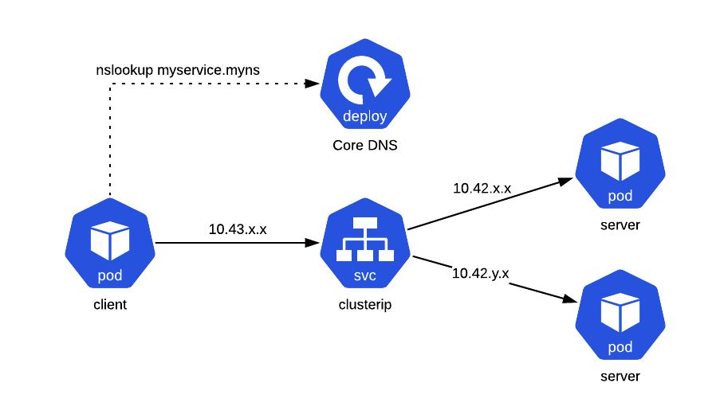

# ClusterIP

[](service.png)

ClusterIP services leverage the kube-proxy to route traffic to backend pod instances.
This approach comes along with many pros and cons.
One of the biggest advantages is being able to [topology-aware routing](https://imroc.io/posts/kubernetes/service-topology-en/).
However, gRPC sees a single address and only establishes one connection to the backend.
This results in requests having an affinity to one backend server. 
Should that backend server go away, requests will fail over to another backend instance. 

```bash
kubectl apply -f k8s/03-gok-client-clusterip/
kubectl logs -f -l app=gok-client-clusterip
kubectl delete pod $(kubectl logs --tail 1 -l app=gok-client-clusterip | awk '{print $6}')
```
