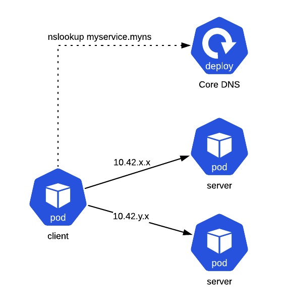

# Headless Service

Be mindful when consuming headless services.
Cloud providers often charge an additional fee for communicating across availability zones.
Since DNS isn't topology aware, resolved addresses may exist in a different AZ.
